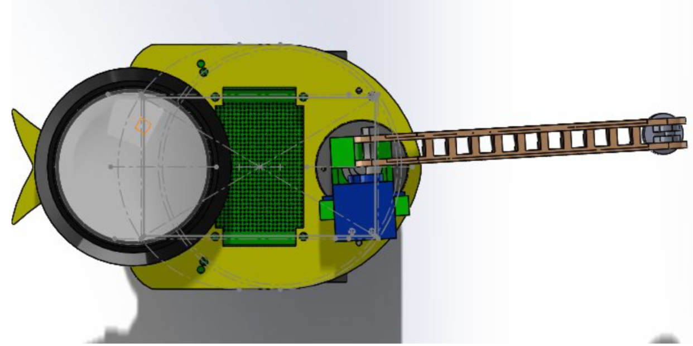

# Mechatronic-Systems

Name: Claire Wang

Date: Sep 10th - Dec 5th, 2018

Description: A series of projects involve electronics and laser-cut prototypes powered by Teensy and ESP32. Repo includes source code and CAD images.

1. [Waldo Manipulator](#waldo)
2. [Remote Controlled Car](#remote)
3. [Fighting Carbot](#carbot)

## Waldo Manipulator 

Partner: Victor Janniaud

A Waldo is an input device used to record a motion that can then be used to move another system (output device) that is typically similar in shape and structure (though not necessarily in size) to the input device. The arms are lasercut and powered by two DC motors. Sensing and calibrating were achieved by two potentiometers and PID loop.

### Input Arm CAD Drawing

### Output Arm CAD Drawing

### Circuit Design

### Video Demo

Youtube: [Waldo Manipulator Full Range Motion](https://youtu.be/CYE2qLOTmjE)

## Remote Controlled Car 

Partners: Victor Janniaud, Jiaqi Zhang

This project is to use wireless communication to design a mobile platform. We used Arduino IDE to propgram the ESP32s, and wifi protocol to send command packages. The car was propulled by two DC motors and direction controlled by differential drive.

### Car CAD Drawings

### Controller CAD Drawings

### Circuit Design

## Fighting Carbot 

Partners: Victor Janniaud, Jiaqi Zhang

The goal of this project is to make a fighting carbot that is WiFi controlled (driving and fighting), powered by both Teensy and ESP32, and ability to communicate health info with central system.

### CAD Drawing

### Circuit Design

### Demo Video

[Driving and Top Hat light Demonstration](https://youtu.be/HnsTC00Yx_s)

[Arm Rotation and Attack](https://youtu.be/IldZx1hD7G4)